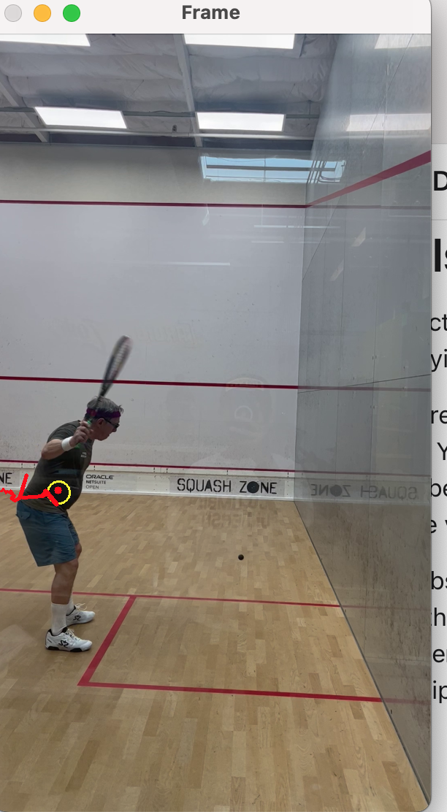

# squash-tracker
Fun personal project trying to track squash player, and ideally the squash ball using OpenCV 

## Notes
The approach behind this tracker is to track an object given the contour of the target and the color.  

I used Gaussian Blur and convert every frame to HSV color space. 

Because of different lighting, angles, etc. I find it bit tricky to define a color range to track for the target. Here I used a colorHelper to help me define color range in HSV format. The colorHelper takes in a frame, and it will return the color code at my cursor location. 

We then mask the frame with for target color, then find contours in the mask that matches our target object. 

Here is a screenshot of the current demo.

## Future Iterations and improvements
1. Squash is black and small. There is a lot of noise in every masked frame. For instance, at the court I used to record my video, the logo in the background is a big squash ball. For the next change I will confine an area in every frame, and mask the rest of the frame. i.e right/left half of the screen / lower right corner. 